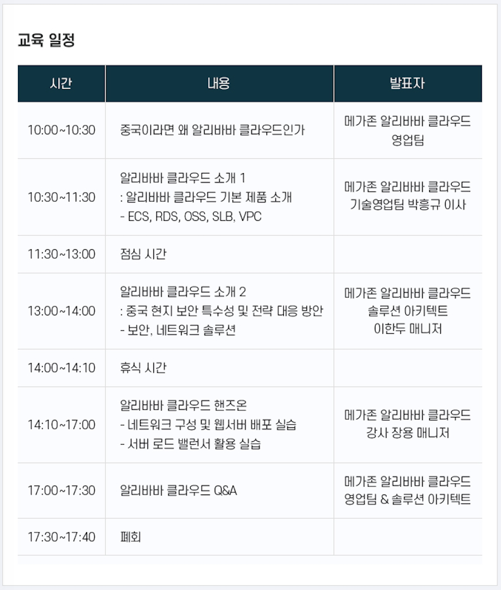

# 알리클라우드 세미나
> 2020.10.28 (수) 10:00 ~ 17:40
> 서울특별시 강남구 역삼동 테헤란로16길 17

>

## 소개
- 알리바바 클라우드 팀 : 사업부장
- 중국 아시아 현지화 교육
- 메가존 + 알리바바 5년째 => 이사갈 때 학교, 전입
- 5년간 진행하면서 노하우 공유 
- 택배 비지니스 할 때 택배차부터 만들지 않는다. 
- 인프라 / 중국 법 제도  (니파(정보통신산업진흥원)? 메가존?)
- 알라바바 1명, 메가존 2명 연락처 .

## 알리바바 / 메가존 소개 
> 권찬혁 매니저 
1. 중국이라면 왜 alibaba cloud 인가?
- 중국 정부의 해외 인터넷, 콘텐츠 차단 (facebook, google 등 접속 안됨)
- 다음, 네이버, 위키피디아 차단 
- 중국 great 방화벽 => 차단 
- cloud 시장도 마찬가지 
- AWS도 중국을 하기 위해서는 내자법인을 설립해서 들어와라 . (amazon.cn)
- 중국 내 알리바바 클라우드 점유율 (아시아/중국 점유율 1위, 세계 3위 사업자)
- 순위 : 1.AWS 2.Azure 3,4 alibabacloud or google
- 중국 리전 : 홍콩 포함 10개? 11개?
- 알리바바 클라우드에서도 투자도 하고 있고 ..
- 중국내 네트워크 노드가 약 2,300개  (현지 여러 통신사와 ..)
- Alibaba group
- 광군절 당일 : 44조 매출? 2019년 

2. Alibaba Cloud Marketplace 
- 카테고리 및 대표 제품. 
- 현재 총 274개 
- BYOL: 사용자 보유 라이선스 사용
- 시간당 / 월별 과금
- 이미지 제공. 
- 시간당: 서버 생성 시점 부터 과금.

3. 메가존 지원
- SA(solution architect) 
- 한국어 서포트 포털 
- 한국 원화결제 지원 (세금계산서)
- 중국 ICP 비안 컨설팅 (중국내 도메인 통신)
- 서버 구축후 보안등급심사 컨설팅 및 대행
- 알리바바 유일 공식 총판. 
- 마켓플리이스에 판매할 솔루션이 있다면 .. 인프라까지 제공할 수 있도록. 지원? (리셀러)
- 모니터링 지원.. (24시간)
- 알리바바에는 티켓 베이스로 문의해야하는데 한국어로 지원 
- 월 8000 USD 하는 알리바바 기술 지원 정도의 지원을 받을 수 있다. 
- 리셀러가 되서 고객을 유치하시면 benefit이 있다. 

## Alibaba Cloud Basic Service Introduce
- Infrastrucure / Data / Solution
- Computing(서)/ Networking / Storage / Database

### VPC (Virture Private Cloud)
ECS / SLB / Disk / Database

Region (국경, 도시라고 생각하면됨)
- 리전 별 속도 차이 : 리전은 1군데 두고 CDN 서비스를 받으면.. 중국 전체 동일한 속도 
- 10개 리전: 1개 리전에 AZ 2개?
- 어떤 서비스를 제공하는 지와 가격 (리전마다 가격이 다름)

Zone
- 전산실이라고 생각하면 이해하기 쉬움 

VPC
- 리전내 zone에 하나로 구성하거나 여러 Zone에 하나 등으로 설정할 수 있다. 
- Layer2에 물리적인...
- 리전내 논리적으로 구성되어 있는 가상의 사설망이다.
- 보통은 하나의 VPC안에 운영, 개발을 같이 사용하고 서브넷으로 구분해서 사용을 한다 .
- VPC 표준 모델
    * VPC 영역 밖은 public
    * VPC 로 접속 전 Anti-DDos / WAF 등을 통해서 접속 
    * SLB -> ECS -> RDS
    * CloudMonitor (모니터링)
    * Server Guard 

VPC 접속 방법
- 일반 IDC와 동일하다 
- VPC와 public 연결은 (CDN <-> SLB) 연결되면서 
- VPN, 전용선, 스마트 VPN?

VPC 구성요소 
- API나 관리자 콘솔을 통해서 관리 
- VSwitch (분산 노드)
- 알리바바 클리우드 중국 1위 
- AWS보다 컴퓨팅 능력에서는 알리바바가 높다.     
- 각 페이지 마다 URL을 적어놨음. (자료 활용)

VPC 구성범위 
- 리전에서 생성할 수 있는 VPC는 10
- VPC네 서브넷 (VSwitch) : 24개 
- 기타는 장표를 확인..

### ECS (Elastic Computiong Service)
인스턴스 종류 
- 알리바바 가상 서버 
- 컴퓨팅 능력은 최상.
- 멀티라인 BGP network (전용선이 듀얼로 들어오기가 어렵다.)
- 기본적으로 클라우드는 멀티라인임. (전용선이 하나 끊겨도 중단되지 않는다.)
- ECS 인스턴스 종류 (서버 종류)
- G6, G5 (일반 웹 서비스)
- H, I 시리즈 
- D 시리즈 : 병렬 처리가 가능한 GPU 서비스도 있음. 

이미지 선택 
- public image: 라이선스 부여되어 있는 OS 이미지 
- 커스텀 이미지: 인스턴스에서 스냅샷을 떠서 만들어 놓은 이미지 
- Shared Image: 다른 계정에서 생성된 이미지를 공유 받을 때
- MarketPlace Image: 솔루션 이미지 

Operation System.
- CentOS : 알리바바에서 가장 안정적으로 운영.

Elasticit (유연성) and Cloud Scalability
- sacaling
- 병렬 스케일링: 웹서버 (자동)
- 수직 스케일링: 사양 업그레이드 (자동은 아님)

Elastic Network
- SLB bandwith 설정. 

Access Control 방법
- SLB whitelists
- network ACL
- ECS inbound / outbound 제어 
- ECS Security Group
- RDS whitelists

Security Group
- 동일한 firewall 규칙을 같는 ECS그룹 
- 사용자당 100개
- ECS인스턴스 당 5개 

### SLB
- Traffic 분선
- Health Checks
- Session Persistence
- Access Control
- SSL 인증서 관리 : 
  

SLB Scheduling Algorithm
- Round-Robin (PR)
- 가중치 Round-Robin

지원 Protocal
- TCP/UDP 기반 Layer-4 (포트로 분류)
- HTTP/HTTPS 기반 Layer-7 (도메인 기준 분류)

고가용성 (High-Availability)
- HA 제공 
- 동일 리전 : Primary Zone / Secondary Zone으로 구성 
- 다수 Region 가용성 제공

### Disk
- OSS < ... < NAS < ... < EBS  (EBS가 고사양)
- OSS : 방대한 양의 정적 데이터 저장. 실제로는 CDN 서비스에서 사용 
  * PB-level (패타바이트 레벨)
  * 파일단위 저장 
- Block Storage : ECS에서는 Block단위 저장 후 사용시 조합 
  * Local Disk(물리적디스크)  
     -> SSD: GPU 기능을 갖춘 ECS, 고사양 인스턴스 
     -> SATA HDD: 대용량. 
  * Cloud Disk() 
     -> ESSD : 조금더 강화된 SSD (OLTP, NoSQL등 속도가 빨라야 되는 곳)
     -> SSD: 표준 SSD
     -> Ultra Disk: 부하가 적은 시스템. 비용 효울적 
     
- NAS (network attached storage)

### Database
#### RDS
- ApsaraDB (브랜드명- 압사라디비) RDS
- 알리바바가 관리해 주는 DB 
- 확장 및 속도면에서 이점이 있음. 
- 안정성 및 확장가능한 온라인 데이터베이스이다. 
- 스토리지도 SSD를 사용한 고사양
- PolarDB - 알리바바에서 가장 빠른 ..

#### NoSQL
- Redis  메모리 DB

#### Data Migration
- DTS 툴을 이용해서 다른 DB로 마이그레이션이 가능함.
- ADAM : 향상된 마이그레이션 툴 .
 

## 3-1. 한-중 네트워크 솔루션
### GA2.0 (Global Acceleration)
- 지연로드, 패킷 
- 중국 서비스...
- 알리바바 클라우드의 백본 회선을 기반으로 - 국제 전용회선 상품 

- GA 서비스 : 북경 <--> 평촌(LGU+) 기 구축된 전용선을 즉시 사용 
- 직접 구매, 설치 지연이 없음. 

- Basic bandwidth plan ?
- 중국에 있는 서버를 한국에서.. 한국에 있는 서비스를 중국에서... 서비스.

### SAG 서비스 
- 온프레미스와 클라우드간 빠른 연결을 가능하게 함. SDWAN네트워크 
- software client / SAG-100 / SAG-1000
- China CCN / Korean CCN을 사용..

### Express Connect 
- 기업 전용회선 연결 
- 물리 회선 설치 
- 전 구간 전용회선으로 연결 
- 안정적임. 
- Delicated connection / Shared Connection (한국에서는 Shared만 가능)
- 한국에서는 평촌 데이터 센터에서 연결됨.

CEN : Cloud Enterprise Network => AWS의 ??? Gateway 서비스와 동일 
CEN 구성: ...
사용사례 : 

질문 
네트워크 관련 질문 : 메일로 해도 됨. 

## 3-2. 알리바바 클라우드 보안 
### Cloud Security
- Zero trust
- 즉각적인 접근 제어 
- 자동 패치 및 관리
- 통합된 보안 시각화 

클라우드 서비스를 사용하는 이유 중 보안서비스가 높다. 

- 인증보안: IDaaS, Bastion Host, RAM,..

#### WAF (와프, Web Application Firewall)
- Web attack protection
- OWS TOP 공격
- Anti-DDos Basic
- Bot 공격 방어 
- 웹서비스를 하고 있으면 WAF를 적용하는 것을 권장. 
- AWS와 다른 점은 기본 정책을 설정하지 않아도 알리바바 빅데이터 기준 정책이 적용됨. 
- 고객이 뭔가 해줘야 하는 것이 없다. 
- 0 Day Protection : 새로운 공격에 대해 빠른 정책 적용이 자동으로 됨. 

#### Security Center
- 서버 보안 위험. 
- WAF가 application 보안 솔루션이라면 Security Center는 서버 보안
- 위험 감지 서비스 : 모니터링, 스캔, 가이드 방법 제공

#### Cloud Firewall
- ??
- 시각화 제공
- Security Group <---> Cloud Firewall  (시각화, 접근제어, 원인분석)

#### Anti-DDos
- 리소스 범위를 넘어서는 트래픽이 들어오면 제대로 서비스할 수 없음. 
- 꼭 해야되는 서비스라고 볼 수 있음. 
- 서비스는 총 3가지 
  * Premium (알리서비스가 아닌 서비스) 
  * Origin (알리서비스) 
  * GameShield (게임에 특화)

#### Bastion Host
- 관리형 서비스로 알리바바가 제공 
- 운영 모니터링 
- 인증 LDAP등

#### RAM
- AWS에 IAM과 동일   

## 4-1. 실습 (이론)
- Iaas : Application/Data/Runtime/Middleware/OS (Virtualization/Network/Storage/Server)
- PaaS : Application/Data (Runtime/Middleware/OS/Virtualization/Network/Storage/Server)
- SaaS : (Application/Data/Runtime/Middleware/OS/Virtualization/Network/Storage/Server)

### Virtualization 
- Data Centers > Server Racks > Virtualization (XEN -> KVM) > ECS

### Region / Zone
- 22개의 리전 (중국 10개)
- 가용영역 (Available Zone)
- 리전간 CEN을 이용하여 통신할 수 있다 ()

### ECS instance
- instance 유형 : CPU, Memory, Storage, Networking의 조합으로 구성.
- ecs.sn1.3xlarge
  * sn: instance family
  * 1: 세대 번호 높을 수 록 최신
  * 3xlarge : 옷 사이즈와 동일 높을수로 좋으.ㅁ 
- 원하는 CPU / Memory를 임의로 설정할 수는 없음. (정해진 유형만 선택 가능)

### Instance Failover
- HA 구성시 SLB서비스를 통해 downtime failover에 대처할 수 있음. 
- 다른 Zone에 구성 

### Cost Optimization 
- Pay As You Go(PAYG) : 초 단위로 사용한 만큼.
- Subscription : 년간 구독설정 시 할인
- 초기 PAYG를 사용하다가 Subscripton으로 변경하는 것을 추천 

---

### Cloud Disk
- ECS에서는 클라우드 Disk를 활용함. 

* 일반 Server : CPU/RAM/HDD/NIC
* Cloud: Instance 내에 (NIC) <----> Storage내 (HDD - Block Storage Service) == Cloud Disk
* 클라우드 공간 3군데에 복제함 (Cloud Disk)

선택 기준은 IOPS(아이옵스)..
- Ultra Cloud Disk
- SSD Cloud Disk

### Disk Image (Snapshot)
- Cloud Disk의 백업본 => Object Storage에 복사 
- 이미 구성된 이미지를 market place에서 설치할 수 있음. (php/nginx/mysql/wordpress)

### VPC
- VLAN (vSwitch, vRouter)을 구성하여 원하는 네트워크 환경을 만들 수 있다. 
- Dedicated line / VPN access : IDC와 
- EIP: 공인IP
- vRouter: 라우터 장비
- vSwitch

#### Region > VPC > vSwitch(subnet)

#### Security Group
- 방화벽 기능. 

## 4-2. 실습 (alibabacloud.com)
### ECS, VPC
- VPC 생성 
- vSwitch(subnet) 생성 
- ECS 생성 > 서버접속 > apache 설치 
- internet IP로 접속 확인 

- Disk > create snapshop > create image > create instance

### SLB
- backend 설정 
- Listener 설정 
- SLB internet ip 접속 시 

질문) 무료 인증서는 지원하지 않음. 

## 질문
- ABB China (ac0619) : http://47.98.59.87 (SLB) | http://47.111.163.58(Internet)
- Foehl-China (fc0806) : http://47.111.178.125 (SLB) | http://121.41.86.83 (EIP)

 
1. 접속 속도 문제
- ECS 인스턴스 생성 후 internet ip로 접속하면 속도가 느림.
- EIP연결 / SLB로 연결하면 조금 개선되지만 여전히 느림.
- Global Accelerator 를 사용하면 개선되는 가?

2. SSH 파일 업로드 속도
- 1GB 정도 파일을 업로드
- 회사에서는 8시간 / 집에서는 1~2분 
- 

2. domain 연결 방법
- ICP 인증 절차  

3. SSL 인증서 
- AWS의 경우 ELB에 무료 인증서 가능 
- 알리 클라우드에서도 가능한가? 
  

