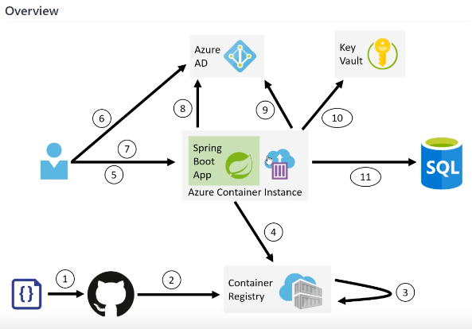

# Azure

docker, spring boot, azure

## AppService > webapp
- spring boot application 배포하기 
- https://www.youtube.com/watch?v=7gJVMzfjHpQ


## Azure Container Instance
아래 영상은 azure api를 이용하여 shell script로 
resource group, docker image 등등을 관리함.  

https://www.youtube.com/watch?v=EO0hdV5Ko1c



- Source 
- github 
- Container Registry 
- Azure Container Registry 
- Azure AD (Active Directory)
- Key Vault (설정파일 저장)
- SQL DB 연결 

> DB를 Docker Image로 구성하는 것이 맞는가? 
> 별도 서비스로 해야하는 것 아닌가? 


## ACR에 로그인 
```
$ az acr login --name ddocker

Login Succeeded
```

## 이미지 별칭 만들기
```
$ docker tag saleson:3.8.0 ddocker.azurecr.io/onlinepowers/saleson:3.8.0
$ docker tag saleson-frontend:3.8.0 ddocker.azurecr.io/onlinepowers/saleson-frontend:3.8.0
```

## 레지스트리에 이미지 푸시하기
```
$ docker push ddocker.azurecr.io/onlinepowers/saleson:3.8.0
$ docker push ddocker.azurecr.io/onlinepowers/saleson-frontend:3.8.0
```


Volumn 연결 2가지 방법

1. WEBAPP_STORAGE_HOME / 
- WEBSITES_ENABLE_APP_SERVICE_STORAGE=TRUE

```
az webapp config appsettings set --resource-group FreeTiar --name saleson-test --settings WEBSITES_ENABLE_APP_SERVICE_STORAGE=TRUE
```

2. Azure File Share
```
az storage share create \
--account-name saleson3 \
--account-key k5HDb60LwAvk2FbOn+fYf7IB+Ih+se+vdrpFGoxjKQnO6CL50kESsEGMcyGfjR/x50Z0H+RRicwQcwsONKb33g== \
--name "saleson-test" \
--quota 1
```

storage 연결 


az webapp config storage-account add -g <MyResourceGroup> -n <MyUniqueApp> \
          --custom-id <CustomId> \
          --storage-type AzureFiles \
          --account-name <MyStorageAccount> \
          --share-name <MyShare> \
          --access-key <MyAccessKey> \
          --mount-path </path/to/mount>
          
          
az webapp config storage-account add -g FreeTiar -n saleson-test \
          --custom-id SalesonTestVolumn \
          --storage-type AzureFiles \
          --account-name saleson3 \
          --share-name saleson-test \
          --access-key k5HDb60LwAvk2FbOn+fYf7IB+Ih+se+vdrpFGoxjKQnO6CL50kESsEGMcyGfjR/x50Z0H+RRicwQcwsONKb33g== \
          --mount-path /usr/share/nginx/html   
          
          

## 도메인 연결 
사용자 지정 도메인 

## SSL
설정 > TLS/SSL 메뉴에서 
1) 프라이빗 키 인증서 > App Service 관리형 인증서 만들기

2) 바인딩 탭에서 
TLS/SSL 바인딩 추가 -> 프라이빗 키 인증서 선택 


## Azure Container Registry 에서 이미지 사용할때 권한 문제 
- /saleson-docker/azure/ acr.sh / acr-role.sh / skv.sh 를 실행했음.
- 좀 더 확인 필요함.


## MYSQL
String url ="jdbc:mysql://saleson-mysql.mysql.database.azure.com:3306/{your_database}?useSSL=true&requireSSL=false"; myDbConn = DriverManager.getConnection(url, "saleson@saleson-mysql", {your_password});


