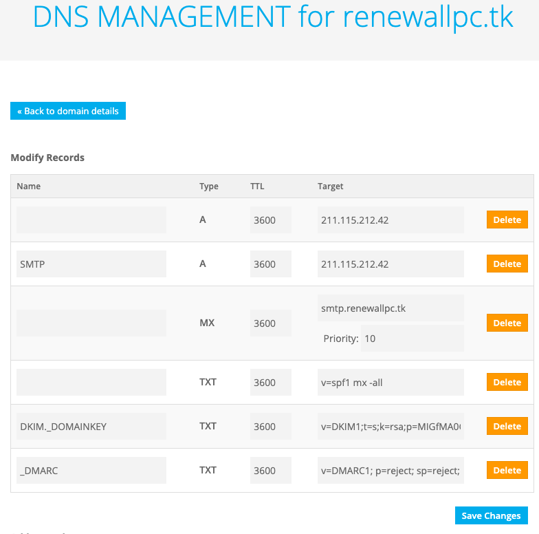

# 삼운유통 개발서버세팅 (samwoon)

## 서버 정보 (nCloud)
http://101.101.216.142

### nCloud 계정
knkky@naver.com
3y7g8p!!

### 리눅스 서버 SSH
ssh root@101.101.162.195 -p 10023
H5niNTAULy

### DB 접속
mysql -u root -p
- pw: Rnjsskarn881106!@
```
dataSource.url=jdbc:log4jdbc:mysql://101.101.216.142:3306/saleson3
dataSource.username=root
dataSource.password=Rnjsskarn881106!@
```


## 서버 설치 
### OpenJDK 1.8
```
$ yum install java-1.8.0-openjdk-devel.x86_64
``` 


### Tomcat 설치 (9.0.43) - saleson-web
- 설치경로: 


### nginx

#### 1. nginx Repository 추가
vi /etc/yum.repos.d/nginx.repo

```
[nginx] 
name=nginx repo 
baseurl=http://nginx.org/packages/centos/7/$basearch/ 
gpgcheck=0 
enabled=1

```

#### 2. install 
```
yum install -y nginx
```


systemctl start nginx


### 방화벽 설정
```
$ firewall-cmd --permanent --zone=public --add-port=80/tcp
$ firewall-cmd --permanent --zone=public --add-port=8080/tcp
$ firewall-cmd --permanent --zone=public --add-port=9080/tcp
$ firewall-cmd --reload

```


## 서버 배포 방법 
### 1. Gradle Build 
intellij에서 Gradle build --exclude-task test 실행하거나 
CMD에서 `gradlew` 명령으로 빌드한다. 

```gradle
$ ./gradlew build --exclude-task test
```

### 2. 파일 업로드 
원격데스크톱으로 연결하거나 SSH로 서버에 접속하여 deploy폴더에 빌드된 파일을 업로드 한다.

#### 빌드된 파일 
- Static : ~/build/distributions/saleson-static.zip
- War : ~/saleson-web/build/libs/saleson-web-3.13.0.war

#### 원격데스크톱 접속 정보 
- IP: 211.115.212.42
- PORT: 9751
- ID/PW: administrator/uniForen1!

#### SSH 접속 
- IP: 211.115.212.42
- PORT: 22
- ID/PW: deploy/pw92%@

#### 배포 폴더 
- G:\home\saleson\deploy

#### 배포 실행 
원격데스크톱 접속 후 배포 폴더에 deploy.bat 파일을 실행한다. 

## 시스템 정보 
### 설치 정보 
- Web Server: nginx 1.18.0
- WAS: Tomcat 9.0.39
- Java: OpenJDK 1.8.0.265
- DB: Mysql Community 8.0.22.0

### 서버 설치 경로 
- Java: G:\server\java
- nginx: G:\server\nginx
- tomcat: G:\server\tomcat
- mysql: C:\Program Files\MySQL
- mysql data: C:\ProgramData\MySQL\

### MYSQL 접속 정보 
> root password: uniForen1!

#### 운영 DB 정보
- IP : 211.115.212.42
- PORT: 3306
- DB: SALESON_RENEWALLPC
- id/pw: renewallpc / renewall92%@


### 서버 시작 / 중지
윈도우 서비스에 등록되어 있음. 

- nginx: 서비스로 등록됨 (서비스 이름: nginx)
- tomcat: 서비스로 등록됨 (서비스 이름: Tomcat9 - Apache Tomcat 9.0) 


## Mysql 8
### 설치 
- MySQL Community Downloads 다운로드 : https://dev.mysql.com/downloads/installer/
- 설치 경로: C:\Program Files\MySQL\MySQL Server 8.0\
- 설치 항목 중 : [v] SQL Server 만 설치함. (client tool등은 제외)
- root 비밀번호 : uniForen1!


### Charset 변경 
C:\ProgramData\MySQL\MySQL Server 8.0\my.ini

```
[client]
default-character-set=utf8mb4

[mysql]
default-character-set=utf8mb4

[mysqld]
character-set-server=utf8mb4
collation-server = utf8mb4_unicode_ci
skip-character-set-client-handshake
```

### DB 및 사용자 생성 
```sql
CREATE DATABASE SALESON_RENEWALLPC;

CREATE USER 'renewallpc'@'localhost' IDENTIFIED BY 'renewall92%@';
GRANT ALL PRIVILEGES ON SALESON_RENEWALLPC.* TO 'renewallpc'@'localhost' WITH GRANT OPTION;

CREATE USER 'renewallpc'@'112.216.32.194' IDENTIFIED BY 'renewall92%@';
GRANT ALL PRIVILEGES ON SALESON_RENEWALLPC.* TO 'renewallpc'@'112.216.32.194' WITH GRANT OPTION;


CREATE USER 'renewallpc'@'121.140.126.5' IDENTIFIED BY 'renewall92%@';
GRANT ALL PRIVILEGES ON SALESON_RENEWALLPC.* TO 'renewallpc'@'121.140.126.5' WITH GRANT OPTION;

FLUSH PRIVILEGES ;


```


## 메일서버 설치 (hMailServer)
> https://xetown.com/tips/1304642
- https://www.hmailserver.com/download
- hMailServer: 5.6.7
- hMailServer Main Password: uniForen1!


### Database 설정 
- db: hmail
- user/pw: root/uniForen1!

### 테스트 계졍
- shop@renewallpc.tk / 1111

### 운영계정 
- webmail@renewallpc.co.kr / webmail92%@
- 

### SPF(Sender Policy Framework)
- TXT : v=spf1 mx -all


### DKIM(DomainKeys Identified Mail)
- 위치: dkim._domainkey TXT
```  
v=DKIM1;t=s;k=rsa;p=MIGfMA0GCSqGSIb3DQEBAQUAA4GNADCBiQKBgQDTeh9npc/1RgkjCCBVVTBuC9r5
10/e1tOvlHX+W8wdLXohrhsRxlOPJh1FhWoCF70u3zOnqkt7fbF0VcTEcy7J4rhq
F0a7EJkNTqFGX4vDwuHPjd2PO8Tsxys/bLRlvARH+2lZ8lLc2i/MjwsLFsncWdxy
M11qYK0XIxshSBMnLQIDAQAB
```


MIGfMA0GCSqGSIb3DQEBAQUAA4GNADCBiQKBgQDTeh9npc/1RgkjCCBVVTBuC9r5
10/e1tOvlHX+W8wdLXohrhsRxlOPJh1FhWoCF70u3zOnqkt7fbF0VcTEcy7J4rhq
F0a7EJkNTqFGX4vDwuHPjd2PO8Tsxys/bLRlvARH+2lZ8lLc2i/MjwsLFsncWdxy
M11qYK0XIxshSBMnLQIDAQAB
### DMARC
```
v=DMARC1; p=reject; sp=reject; adkim=s; rua=shop@renewallpc.tk;
```

### DNS 설정 예시 



### [참고] Mysql Community 8.0 설치 로그 
```
1: Action 16:23:32: INSTALL. 
1: 1: MySQL Server 8.0 2: {3476AEF8-4E53-40FE-90C4-5179DF0DFA3F} 
1: Action 16:23:32: FindRelatedProducts. Searching for related applications
1: Action 16:23:32: AppSearch. Searching for installed applications
1: Action 16:23:32: DwordToNumber. 
1: Action 16:23:32: LaunchConditions. Evaluating launch conditions
1: Action 16:23:32: ValidateProductID. 
1: Action 16:23:32: CostInitialize. Computing space requirements
1: Action 16:23:32: FileCost. Computing space requirements
1: Action 16:23:32: CostFinalize. Computing space requirements
1: Action 16:23:32: MigrateFeatureStates. Migrating feature states from related applications
1: Action 16:23:32: InstallValidate. Validating install
1: Action 16:23:32: SaveTargetDir. 
1: Action 16:23:32: InstallInitialize. 
1: Action 16:23:32: SetQtRemoveService. 
1: Action 16:23:32: RemoveExistingProducts. Removing applications
1: Action 16:23:32: ProcessComponents. Updating component registration
1: Action 16:23:33: GenerateScript. Generating script operations for action:
1: Updating component registration
1: Action 16:23:33: UnpublishFeatures. Unpublishing Product Features
1: Action 16:23:33: RemoveRegistryValues. Removing system registry values
1: Action 16:23:33: RemoveShortcuts. Removing shortcuts
1: Action 16:23:33: RemoveFiles. Removing files
1: Action 16:23:33: InstallFiles. Copying new files
1: File: Copying new files,  Directory: ,  Size: 
1: Action 16:23:33: CreateShortcuts. Creating shortcuts
1: Shortcut: Creating shortcuts
1: Action 16:23:33: WriteRegistryValues. Writing system registry values
1: Key: Writing system registry values, Name: , Value: 
1: Action 16:23:33: RegisterUser. Registering user
1: Action 16:23:33: RegisterProduct. Registering product
1: Registering product
1: Action 16:23:33: PublishFeatures. Publishing Product Features
1: Feature: Publishing Product Features
1: Action 16:23:33: PublishProduct. Publishing product information
1: Action 16:23:33: InstallFinalize. 
1: Action 16:23:33: ProcessComponents. Updating component registration
1: Action 16:23:33: InstallFiles. Copying new files
1: File: harness-library.dll,  Directory: C:\Program Files\MySQL\MySQL Server 8.0\bin\,  Size: 659456
1: File: ibd2sdi.exe,  Directory: C:\Program Files\MySQL\MySQL Server 8.0\bin\,  Size: 6379624
1: File: innochecksum.exe,  Directory: C:\Program Files\MySQL\MySQL Server 8.0\bin\,  Size: 6366840
1: File: libcrypto-1_1-x64.dll,  Directory: C:\Program Files\MySQL\MySQL Server 8.0\bin\,  Size: 3422720
1: File: libmecab.dll,  Directory: C:\Program Files\MySQL\MySQL Server 8.0\bin\,  Size: 1839616
1: File: libprotobuf.dll,  Directory: C:\Program Files\MySQL\MySQL Server 8.0\bin\,  Size: 2832896
1: File: libprotobuf.lib,  Directory: C:\Program Files\MySQL\MySQL Server 8.0\bin\,  Size: 4179030
1: File: libprotobuf-debug.dll,  Directory: C:\Program Files\MySQL\MySQL Server 8.0\bin\,  Size: 6872064
1: File: libprotobuf-lite.dll,  Directory: C:\Program Files\MySQL\MySQL Server 8.0\bin\,  Size: 553472
1: File: libprotobuf-lite.lib,  Directory: C:\Program Files\MySQL\MySQL Server 8.0\bin\,  Size: 898420
1: File: libprotobuf-lite-debug.dll,  Directory: C:\Program Files\MySQL\MySQL Server 8.0\bin\,  Size: 1358336
1: File: libssl-1_1-x64.dll,  Directory: C:\Program Files\MySQL\MySQL Server 8.0\bin\,  Size: 686592
1: File: lz4_decompress.exe,  Directory: C:\Program Files\MySQL\MySQL Server 8.0\bin\,  Size: 6311544
1: File: my_print_defaults.exe,  Directory: C:\Program Files\MySQL\MySQL Server 8.0\bin\,  Size: 6251648
1: File: myisam_ftdump.exe,  Directory: C:\Program Files\MySQL\MySQL Server 8.0\bin\,  Size: 6508664
1: File: myisamchk.exe,  Directory: C:\Program Files\MySQL\MySQL Server 8.0\bin\,  Size: 6633584
1: File: myisamlog.exe,  Directory: C:\Program Files\MySQL\MySQL Server 8.0\bin\,  Size: 6477936
1: File: myisampack.exe,  Directory: C:\Program Files\MySQL\MySQL Server 8.0\bin\,  Size: 6531696
1: File: mysql.exe,  Directory: C:\Program Files\MySQL\MySQL Server 8.0\bin\,  Size: 6948968
1: File: mysql_config_editor.exe,  Directory: C:\Program Files\MySQL\MySQL Server 8.0\bin\,  Size: 6266496
1: File: mysql_secure_installation.exe,  Directory: C:\Program Files\MySQL\MySQL Server 8.0\bin\,  Size: 6834320
1: File: mysql_ssl_rsa_setup.exe,  Directory: C:\Program Files\MySQL\MySQL Server 8.0\bin\,  Size: 6293120
1: File: mysql_tzinfo_to_sql.exe,  Directory: C:\Program Files\MySQL\MySQL Server 8.0\bin\,  Size: 6207104
1: File: mysql_upgrade.exe,  Directory: C:\Program Files\MySQL\MySQL Server 8.0\bin\,  Size: 6925432
1: File: mysqladmin.exe,  Directory: C:\Program Files\MySQL\MySQL Server 8.0\bin\,  Size: 6845040
1: File: mysqlbinlog.exe,  Directory: C:\Program Files\MySQL\MySQL Server 8.0\bin\,  Size: 7151728
1: File: mysqlcheck.exe,  Directory: C:\Program Files\MySQL\MySQL Server 8.0\bin\,  Size: 6851696
1: File: mysqld.exe,  Directory: C:\Program Files\MySQL\MySQL Server 8.0\bin\,  Size: 49981544
1: File: mysqld_multi.pl,  Directory: C:\Program Files\MySQL\MySQL Server 8.0\bin\,  Size: 28797
1: File: mysqldump.exe,  Directory: C:\Program Files\MySQL\MySQL Server 8.0\bin\,  Size: 6911088
1: File: mysqldumpslow.pl,  Directory: C:\Program Files\MySQL\MySQL Server 8.0\bin\,  Size: 7902
1: File: mysqlharness_stdx.dll,  Directory: C:\Program Files\MySQL\MySQL Server 8.0\bin\,  Size: 34432
1: File: mysqlimport.exe,  Directory: C:\Program Files\MySQL\MySQL Server 8.0\bin\,  Size: 6837872
1: File: mysqlpump.exe,  Directory: C:\Program Files\MySQL\MySQL Server 8.0\bin\,  Size: 7306352
1: File: mysqlrouter.exe,  Directory: C:\Program Files\MySQL\MySQL Server 8.0\bin\,  Size: 7425136
1: File: mysqlrouter_http.dll,  Directory: C:\Program Files\MySQL\MySQL Server 8.0\bin\,  Size: 258176
1: File: mysqlrouter_http_auth_backend.dll,  Directory: C:\Program Files\MySQL\MySQL Server 8.0\bin\,  Size: 101016
1: File: mysqlrouter_http_auth_realm.dll,  Directory: C:\Program Files\MySQL\MySQL Server 8.0\bin\,  Size: 30864
1: File: mysqlrouter_io_component.dll,  Directory: C:\Program Files\MySQL\MySQL Server 8.0\bin\,  Size: 72848
1: File: mysqlrouter_keyring.exe,  Directory: C:\Program Files\MySQL\MySQL Server 8.0\bin\,  Size: 7472256
1: File: mysqlrouter_passwd.exe,  Directory: C:\Program Files\MySQL\MySQL Server 8.0\bin\,  Size: 7445632
1: File: mysqlrouter_plugin_info.exe,  Directory: C:\Program Files\MySQL\MySQL Server 8.0\bin\,  Size: 6235784
1: File: mysqlshow.exe,  Directory: C:\Program Files\MySQL\MySQL Server 8.0\bin\,  Size: 6835824
1: File: mysqlslap.exe,  Directory: C:\Program Files\MySQL\MySQL Server 8.0\bin\,  Size: 6853744
1: File: perror.exe,  Directory: C:\Program Files\MySQL\MySQL Server 8.0\bin\,  Size: 7024744
1: File: zlib_decompress.exe,  Directory: C:\Program Files\MySQL\MySQL Server 8.0\bin\,  Size: 6228600
1: File: ChangeLog,  Directory: C:\Program Files\MySQL\MySQL Server 8.0\docs\,  Size: 22
1: File: INFO_SRC,  Directory: C:\Program Files\MySQL\MySQL Server 8.0\docs\,  Size: 188
1: File: sample_mysqlrouter.conf,  Directory: C:\Program Files\MySQL\MySQL Server 8.0\docs\,  Size: 2234
1: File: mysqlrouter.conf.sample,  Directory: C:\Program Files\MySQL\MySQL Server 8.0\etc\,  Size: 1693
1: File: errmsg.h,  Directory: C:\Program Files\MySQL\MySQL Server 8.0\include\,  Size: 5573
1: File: field_types.h,  Directory: C:\Program Files\MySQL\MySQL Server 8.0\include\,  Size: 3169
1: File: my_command.h,  Directory: C:\Program Files\MySQL\MySQL Server 8.0\include\,  Size: 4386
1: File: my_compress.h,  Directory: C:\Program Files\MySQL\MySQL Server 8.0\include\,  Size: 3661
1: File: my_list.h,  Directory: C:\Program Files\MySQL\MySQL Server 8.0\include\,  Size: 2186
1: File: mysql.h,  Directory: C:\Program Files\MySQL\MySQL Server 8.0\include\,  Size: 32818
1: File: client_plugin.h,  Directory: C:\Program Files\MySQL\MySQL Server 8.0\include\mysql\,  Size: 7588
1: File: mysql_com.h,  Directory: C:\Program Files\MySQL\MySQL Server 8.0\include\,  Size: 35020
1: File: plugin_auth_common.h,  Directory: C:\Program Files\MySQL\MySQL Server 8.0\include\mysql\,  Size: 6565
1: File: mysql_time.h,  Directory: C:\Program Files\MySQL\MySQL Server 8.0\include\,  Size: 3575
1: File: udf_registration_types.h,  Directory: C:\Program Files\MySQL\MySQL Server 8.0\include\mysql\,  Size: 3848
1: File: mysql_version.h,  Directory: C:\Program Files\MySQL\MySQL Server 8.0\include\,  Size: 1120
1: File: mysqld_error.h,  Directory: C:\Program Files\MySQL\MySQL Server 8.0\include\,  Size: 235837
1: File: mysqlx_ername.h,  Directory: C:\Program Files\MySQL\MySQL Server 8.0\include\,  Size: 7325
1: File: mysqlx_error.h,  Directory: C:\Program Files\MySQL\MySQL Server 8.0\include\,  Size: 4232
1: File: mysqlx_version.h,  Directory: C:\Program Files\MySQL\MySQL Server 8.0\include\,  Size: 1861
1: File: applink.c,  Directory: C:\Program Files\MySQL\MySQL Server 8.0\include\openssl\,  Size: 3508
1: File: http_auth_backend.dll,  Directory: C:\Program Files\MySQL\MySQL Server 8.0\lib\,  Size: 7427584
1: File: http_auth_realm.dll,  Directory: C:\Program Files\MySQL\MySQL Server 8.0\lib\,  Size: 7427072
1: File: http_server.dll,  Directory: C:\Program Files\MySQL\MySQL Server 8.0\lib\,  Size: 7689216
1: File: io.dll,  Directory: C:\Program Files\MySQL\MySQL Server 8.0\lib\,  Size: 7421952
1: File: keepalive.dll,  Directory: C:\Program Files\MySQL\MySQL Server 8.0\lib\,  Size: 18944
1: File: libmysql.dll,  Directory: C:\Program Files\MySQL\MySQL Server 8.0\lib\,  Size: 6817792
1: File: libmysql.lib,  Directory: C:\Program Files\MySQL\MySQL Server 8.0\lib\,  Size: 29444
1: File: libprotobuf-lite.dll,  Directory: C:\Program Files\MySQL\MySQL Server 8.0\lib\,  Size: 553472
1: File: libprotobuf-lite.lib,  Directory: C:\Program Files\MySQL\MySQL Server 8.0\lib\,  Size: 898420
1: File: char.bin,  Directory: C:\Program Files\MySQL\MySQL Server 8.0\lib\mecab\dic\ipadic_euc-jp\,  Size: 262496
1: File: dicrc,  Directory: C:\Program Files\MySQL\MySQL Server 8.0\lib\mecab\dic\ipadic_euc-jp\,  Size: 693
1: File: left-id.def,  Directory: C:\Program Files\MySQL\MySQL Server 8.0\lib\mecab\dic\ipadic_euc-jp\,  Size: 55910
1: File: matrix.bin,  Directory: C:\Program Files\MySQL\MySQL Server 8.0\lib\mecab\dic\ipadic_euc-jp\,  Size: 3463716
1: File: pos-id.def,  Directory: C:\Program Files\MySQL\MySQL Server 8.0\lib\mecab\dic\ipadic_euc-jp\,  Size: 1477
1: File: rewrite.def,  Directory: C:\Program Files\MySQL\MySQL Server 8.0\lib\mecab\dic\ipadic_euc-jp\,  Size: 6241
1: File: right-id.def,  Directory: C:\Program Files\MySQL\MySQL Server 8.0\lib\mecab\dic\ipadic_euc-jp\,  Size: 55910
1: File: sys.dic,  Directory: C:\Program Files\MySQL\MySQL Server 8.0\lib\mecab\dic\ipadic_euc-jp\,  Size: 37779919
1: File: unk.dic,  Directory: C:\Program Files\MySQL\MySQL Server 8.0\lib\mecab\dic\ipadic_euc-jp\,  Size: 5409
1: File: char.bin,  Directory: C:\Program Files\MySQL\MySQL Server 8.0\lib\mecab\dic\ipadic_sjis\,  Size: 262496
1: File: dicrc,  Directory: C:\Program Files\MySQL\MySQL Server 8.0\lib\mecab\dic\ipadic_sjis\,  Size: 693
1: File: left-id.def,  Directory: C:\Program Files\MySQL\MySQL Server 8.0\lib\mecab\dic\ipadic_sjis\,  Size: 55910
1: File: matrix.bin,  Directory: C:\Program Files\MySQL\MySQL Server 8.0\lib\mecab\dic\ipadic_sjis\,  Size: 3463716
1: File: pos-id.def,  Directory: C:\Program Files\MySQL\MySQL Server 8.0\lib\mecab\dic\ipadic_sjis\,  Size: 1477
1: File: rewrite.def,  Directory: C:\Program Files\MySQL\MySQL Server 8.0\lib\mecab\dic\ipadic_sjis\,  Size: 6241
1: File: right-id.def,  Directory: C:\Program Files\MySQL\MySQL Server 8.0\lib\mecab\dic\ipadic_sjis\,  Size: 55910
1: File: sys.dic,  Directory: C:\Program Files\MySQL\MySQL Server 8.0\lib\mecab\dic\ipadic_sjis\,  Size: 37635899
1: File: unk.dic,  Directory: C:\Program Files\MySQL\MySQL Server 8.0\lib\mecab\dic\ipadic_sjis\,  Size: 5409
1: File: char.bin,  Directory: C:\Program Files\MySQL\MySQL Server 8.0\lib\mecab\dic\ipadic_utf-8\,  Size: 262496
1: File: dicrc,  Directory: C:\Program Files\MySQL\MySQL Server 8.0\lib\mecab\dic\ipadic_utf-8\,  Size: 693
1: File: left-id.def,  Directory: C:\Program Files\MySQL\MySQL Server 8.0\lib\mecab\dic\ipadic_utf-8\,  Size: 55910
1: File: matrix.bin,  Directory: C:\Program Files\MySQL\MySQL Server 8.0\lib\mecab\dic\ipadic_utf-8\,  Size: 3463716
1: File: pos-id.def,  Directory: C:\Program Files\MySQL\MySQL Server 8.0\lib\mecab\dic\ipadic_utf-8\,  Size: 1477
1: File: rewrite.def,  Directory: C:\Program Files\MySQL\MySQL Server 8.0\lib\mecab\dic\ipadic_utf-8\,  Size: 6241
1: File: right-id.def,  Directory: C:\Program Files\MySQL\MySQL Server 8.0\lib\mecab\dic\ipadic_utf-8\,  Size: 55910
1: File: sys.dic,  Directory: C:\Program Files\MySQL\MySQL Server 8.0\lib\mecab\dic\ipadic_utf-8\,  Size: 49199027
1: File: unk.dic,  Directory: C:\Program Files\MySQL\MySQL Server 8.0\lib\mecab\dic\ipadic_utf-8\,  Size: 5690
1: File: mecabrc,  Directory: C:\Program Files\MySQL\MySQL Server 8.0\lib\mecab\etc\,  Size: 1403
1: File: metadata_cache.dll,  Directory: C:\Program Files\MySQL\MySQL Server 8.0\lib\,  Size: 8199168
1: File: mysql_protocol.dll,  Directory: C:\Program Files\MySQL\MySQL Server 8.0\lib\,  Size: 71680
1: File: mysqlclient.lib,  Directory: C:\Program Files\MySQL\MySQL Server 8.0\lib\,  Size: 36837460
1: File: mysqlharness_stdx.lib,  Directory: C:\Program Files\MySQL\MySQL Server 8.0\lib\,  Size: 10026
1: File: mysqlrouter_http.lib,  Directory: C:\Program Files\MySQL\MySQL Server 8.0\lib\,  Size: 44750
1: File: mysqlrouter_http_auth_backend.lib,  Directory: C:\Program Files\MySQL\MySQL Server 8.0\lib\,  Size: 47760
1: File: mysqlrouter_http_auth_realm.lib,  Directory: C:\Program Files\MySQL\MySQL Server 8.0\lib\,  Size: 11770
1: File: mysqlrouter_io_component.lib,  Directory: C:\Program Files\MySQL\MySQL Server 8.0\lib\,  Size: 12642
1: File: mysqlrouter_lib.lib,  Directory: C:\Program Files\MySQL\MySQL Server 8.0\lib\,  Size: 20776780
1: File: adt_null.dll,  Directory: C:\Program Files\MySQL\MySQL Server 8.0\lib\plugin\,  Size: 25088
1: File: component_audit_api_message_emit.dll,  Directory: C:\Program Files\MySQL\MySQL Server 8.0\lib\plugin\,  Size: 24064
1: File: component_log_filter_dragnet.dll,  Directory: C:\Program Files\MySQL\MySQL Server 8.0\lib\plugin\,  Size: 31232
1: File: component_log_sink_json.dll,  Directory: C:\Program Files\MySQL\MySQL Server 8.0\lib\plugin\,  Size: 35840
1: File: component_log_sink_syseventlog.dll,  Directory: C:\Program Files\MySQL\MySQL Server 8.0\lib\plugin\,  Size: 17408
1: File: component_mysqlbackup.dll,  Directory: C:\Program Files\MySQL\MySQL Server 8.0\lib\plugin\,  Size: 42496
1: File: component_validate_password.dll,  Directory: C:\Program Files\MySQL\MySQL Server 8.0\lib\plugin\,  Size: 59392
1: File: connection_control.dll,  Directory: C:\Program Files\MySQL\MySQL Server 8.0\lib\plugin\,  Size: 43008
1: File: ddl_rewriter.dll,  Directory: C:\Program Files\MySQL\MySQL Server 8.0\lib\plugin\,  Size: 68096
1: File: group_replication.dll,  Directory: C:\Program Files\MySQL\MySQL Server 8.0\lib\plugin\,  Size: 1615360
1: File: ha_example.dll,  Directory: C:\Program Files\MySQL\MySQL Server 8.0\lib\plugin\,  Size: 30208
1: File: ha_mock.dll,  Directory: C:\Program Files\MySQL\MySQL Server 8.0\lib\plugin\,  Size: 37376
1: File: keyring_file.dll,  Directory: C:\Program Files\MySQL\MySQL Server 8.0\lib\plugin\,  Size: 102912
1: File: keyring_udf.dll,  Directory: C:\Program Files\MySQL\MySQL Server 8.0\lib\plugin\,  Size: 24576
1: File: libpluginmecab.dll,  Directory: C:\Program Files\MySQL\MySQL Server 8.0\lib\plugin\,  Size: 28672
1: File: locking_service.dll,  Directory: C:\Program Files\MySQL\MySQL Server 8.0\lib\plugin\,  Size: 12800
1: File: mypluglib.dll,  Directory: C:\Program Files\MySQL\MySQL Server 8.0\lib\plugin\,  Size: 12800
1: File: mysql_clone.dll,  Directory: C:\Program Files\MySQL\MySQL Server 8.0\lib\plugin\,  Size: 128000
1: File: mysql_no_login.dll,  Directory: C:\Program Files\MySQL\MySQL Server 8.0\lib\plugin\,  Size: 11264
1: File: rewrite_example.dll,  Directory: C:\Program Files\MySQL\MySQL Server 8.0\lib\plugin\,  Size: 12800
1: File: rewriter.dll,  Directory: C:\Program Files\MySQL\MySQL Server 8.0\lib\plugin\,  Size: 55296
1: File: semisync_master.dll,  Directory: C:\Program Files\MySQL\MySQL Server 8.0\lib\plugin\,  Size: 74240
1: File: semisync_slave.dll,  Directory: C:\Program Files\MySQL\MySQL Server 8.0\lib\plugin\,  Size: 29184
1: File: validate_password.dll,  Directory: C:\Program Files\MySQL\MySQL Server 8.0\lib\plugin\,  Size: 47616
1: File: version_token.dll,  Directory: C:\Program Files\MySQL\MySQL Server 8.0\lib\plugin\,  Size: 48640
1: File: rest_api.dll,  Directory: C:\Program Files\MySQL\MySQL Server 8.0\lib\,  Size: 7470080
1: File: rest_metadata_cache.dll,  Directory: C:\Program Files\MySQL\MySQL Server 8.0\lib\,  Size: 7483392
1: File: rest_router.dll,  Directory: C:\Program Files\MySQL\MySQL Server 8.0\lib\,  Size: 7458304
1: File: rest_routing.dll,  Directory: C:\Program Files\MySQL\MySQL Server 8.0\lib\,  Size: 7501824
1: File: router_protobuf.dll,  Directory: C:\Program Files\MySQL\MySQL Server 8.0\lib\,  Size: 10752
1: File: routing.dll,  Directory: C:\Program Files\MySQL\MySQL Server 8.0\lib\,  Size: 7681024
1: File: LICENSE,  Directory: C:\Program Files\MySQL\MySQL Server 8.0\,  Size: 378912
1: File: LICENSE.router,  Directory: C:\Program Files\MySQL\MySQL Server 8.0\,  Size: 45323
1: File: README,  Directory: C:\Program Files\MySQL\MySQL Server 8.0\,  Size: 687
1: File: README.router,  Directory: C:\Program Files\MySQL\MySQL Server 8.0\,  Size: 700
1: File: errmsg.sys,  Directory: C:\Program Files\MySQL\MySQL Server 8.0\share\bulgarian\,  Size: 323556
1: File: armscii8.xml,  Directory: C:\Program Files\MySQL\MySQL Server 8.0\share\charsets\,  Size: 5939
1: File: ascii.xml,  Directory: C:\Program Files\MySQL\MySQL Server 8.0\share\charsets\,  Size: 5925
1: File: cp1250.xml,  Directory: C:\Program Files\MySQL\MySQL Server 8.0\share\charsets\,  Size: 8654
1: File: cp1251.xml,  Directory: C:\Program Files\MySQL\MySQL Server 8.0\share\charsets\,  Size: 8783
1: File: cp1256.xml,  Directory: C:\Program Files\MySQL\MySQL Server 8.0\share\charsets\,  Size: 5982
1: File: cp1257.xml,  Directory: C:\Program Files\MySQL\MySQL Server 8.0\share\charsets\,  Size: 9315
1: File: cp850.xml,  Directory: C:\Program Files\MySQL\MySQL Server 8.0\share\charsets\,  Size: 5919
1: File: cp852.xml,  Directory: C:\Program Files\MySQL\MySQL Server 8.0\share\charsets\,  Size: 5941
1: File: cp866.xml,  Directory: C:\Program Files\MySQL\MySQL Server 8.0\share\charsets\,  Size: 6026
1: File: dec8.xml,  Directory: C:\Program Files\MySQL\MySQL Server 8.0\share\charsets\,  Size: 6942
1: File: geostd8.xml,  Directory: C:\Program Files\MySQL\MySQL Server 8.0\share\charsets\,  Size: 5929
1: File: greek.xml,  Directory: C:\Program Files\MySQL\MySQL Server 8.0\share\charsets\,  Size: 6141
1: File: hebrew.xml,  Directory: C:\Program Files\MySQL\MySQL Server 8.0\share\charsets\,  Size: 5930
1: File: hp8.xml,  Directory: C:\Program Files\MySQL\MySQL Server 8.0\share\charsets\,  Size: 5915
1: File: Index.xml,  Directory: C:\Program Files\MySQL\MySQL Server 8.0\share\charsets\,  Size: 19495
1: File: keybcs2.xml,  Directory: C:\Program Files\MySQL\MySQL Server 8.0\share\charsets\,  Size: 5942
1: File: koi8r.xml,  Directory: C:\Program Files\MySQL\MySQL Server 8.0\share\charsets\,  Size: 5923
1: File: koi8u.xml,  Directory: C:\Program Files\MySQL\MySQL Server 8.0\share\charsets\,  Size: 6945
1: File: latin1.xml,  Directory: C:\Program Files\MySQL\MySQL Server 8.0\share\charsets\,  Size: 10229
1: File: latin2.xml,  Directory: C:\Program Files\MySQL\MySQL Server 8.0\share\charsets\,  Size: 7651
1: File: latin5.xml,  Directory: C:\Program Files\MySQL\MySQL Server 8.0\share\charsets\,  Size: 5928
1: File: latin7.xml,  Directory: C:\Program Files\MySQL\MySQL Server 8.0\share\charsets\,  Size: 7851
1: File: macce.xml,  Directory: C:\Program Files\MySQL\MySQL Server 8.0\share\charsets\,  Size: 8460
1: File: macroman.xml,  Directory: C:\Program Files\MySQL\MySQL Server 8.0\share\charsets\,  Size: 8471
1: File: README,  Directory: C:\Program Files\MySQL\MySQL Server 8.0\share\charsets\,  Size: 1749
1: File: swe7.xml,  Directory: C:\Program Files\MySQL\MySQL Server 8.0\share\charsets\,  Size: 6943
1: File: errmsg.sys,  Directory: C:\Program Files\MySQL\MySQL Server 8.0\share\czech\,  Size: 323478
1: File: errmsg.sys,  Directory: C:\Program Files\MySQL\MySQL Server 8.0\share\danish\,  Size: 323478
1: File: dictionary.txt,  Directory: C:\Program Files\MySQL\MySQL Server 8.0\share\,  Size: 25575
1: File: errmsg.sys,  Directory: C:\Program Files\MySQL\MySQL Server 8.0\share\dutch\,  Size: 324498
1: File: errmsg.sys,  Directory: C:\Program Files\MySQL\MySQL Server 8.0\share\english\,  Size: 322719
1: File: errmsg.sys,  Directory: C:\Program Files\MySQL\MySQL Server 8.0\share\estonian\,  Size: 322983
1: File: errmsg.sys,  Directory: C:\Program Files\MySQL\MySQL Server 8.0\share\french\,  Size: 324126
1: File: errmsg.sys,  Directory: C:\Program Files\MySQL\MySQL Server 8.0\share\german\,  Size: 330371
1: File: errmsg.sys,  Directory: C:\Program Files\MySQL\MySQL Server 8.0\share\greek\,  Size: 329510
1: File: errmsg.sys,  Directory: C:\Program Files\MySQL\MySQL Server 8.0\share\hungarian\,  Size: 323360
1: File: errmsg.sys,  Directory: C:\Program Files\MySQL\MySQL Server 8.0\share\italian\,  Size: 324489
1: File: errmsg.sys,  Directory: C:\Program Files\MySQL\MySQL Server 8.0\share\japanese\,  Size: 330165
1: File: errmsg.sys,  Directory: C:\Program Files\MySQL\MySQL Server 8.0\share\korean\,  Size: 325759
1: File: messages_to_clients.txt,  Directory: C:\Program Files\MySQL\MySQL Server 8.0\share\,  Size: 602984
1: File: messages_to_error_log.txt,  Directory: C:\Program Files\MySQL\MySQL Server 8.0\share\,  Size: 330668
1: File: errmsg.sys,  Directory: C:\Program Files\MySQL\MySQL Server 8.0\share\norwegian\,  Size: 322789
1: File: errmsg.sys,  Directory: C:\Program Files\MySQL\MySQL Server 8.0\share\norwegian-ny\,  Size: 322842
1: File: errmsg.sys,  Directory: C:\Program Files\MySQL\MySQL Server 8.0\share\polish\,  Size: 323648
1: File: errmsg.sys,  Directory: C:\Program Files\MySQL\MySQL Server 8.0\share\portuguese\,  Size: 325679
1: File: errmsg.sys,  Directory: C:\Program Files\MySQL\MySQL Server 8.0\share\romanian\,  Size: 324431
1: File: errmsg.sys,  Directory: C:\Program Files\MySQL\MySQL Server 8.0\share\russian\,  Size: 337945
1: File: errmsg.sys,  Directory: C:\Program Files\MySQL\MySQL Server 8.0\share\serbian\,  Size: 325100
1: File: errmsg.sys,  Directory: C:\Program Files\MySQL\MySQL Server 8.0\share\slovak\,  Size: 323245
1: File: errmsg.sys,  Directory: C:\Program Files\MySQL\MySQL Server 8.0\share\spanish\,  Size: 324373
1: File: errmsg.sys,  Directory: C:\Program Files\MySQL\MySQL Server 8.0\share\swedish\,  Size: 323572
1: File: errmsg.sys,  Directory: C:\Program Files\MySQL\MySQL Server 8.0\share\ukrainian\,  Size: 332568
1: Action 16:23:36: CreateShortcuts. Creating shortcuts
1: Shortcut: icon.ico
1: Shortcut: Icon.MysqlCmdShell
1: Shortcut: rpxm3ds_|MySQL 8.0 Command Line Client
1: Shortcut: 7ejegqmo|MySQL 8.0 Command Line Client - Unicode
1: Action 16:23:36: WriteRegistryValues. Writing system registry values
1: Key: \SOFTWARE\MySQL AB\MySQL Server 8.0, Name: Location, Value: C:\Program Files\MySQL\MySQL Server 8.0\
1: Key: \SOFTWARE\MySQL AB\MySQL Server 8.0, Name: Version, Value: 8.0.22
1: Key: \SOFTWARE\MySQL AB\MySQL Server 8.0, Name: DataLocation, Value: C:\ProgramData\MySQL\MySQL Server 8.0
1: Key: \SOFTWARE\MySQL AB\MySQL Server 8.0, Name: , Value: 
1: Key: \Console\MySQL 8.0 Command Line Client - Unicode, Name: FaceName, Value: Lucida Console
1: Key: \Console\MySQL 8.0 Command Line Client - Unicode, Name: FontWeight, Value: #400
1: Key: \Console\MySQL 8.0 Command Line Client - Unicode, Name: , Value: 
1: Key: \Software\MySQL AB\MySQL Server 8.0, Name: installed, Value: #1
1: Action 16:23:36: RegisterProduct. Registering product
1: {3476AEF8-4E53-40FE-90C4-5179DF0DFA3F}
1: Action 16:23:36: PublishFeatures. Publishing Product Features
1: Feature: RegKeys
1: Feature: Client
1: Feature: MYSQLSERVER
1: Feature: DEVEL
1: Feature: DOCUMENTATION
1: Feature: Readme
1: Feature: ALWAYSINSTALL
1: Feature: Router
1: Feature: Server_Scripts
1: Feature: MISC
1: Feature: ProgramMenu
1: Action 16:23:36: PublishProduct. Publishing product information
1: Action 16:23:36: RollbackCleanup. Removing backup files
1: 1: MySQL Server 8.0 2: {3476AEF8-4E53-40FE-90C4-5179DF0DFA3F} 3: 1 
1: The action 'Install' for product 'MySQL Server 8.0.22' completed successfully.

```